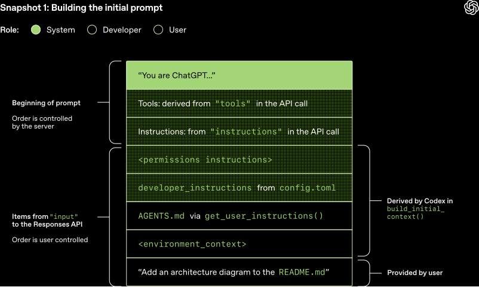

# Instructions

- Use existing documents:
  使用现有的操作程序、支持脚本或政策文档来创建 LLM 友好的 routines.
- Prompt agents to break down tasks:
  提供更小、更清晰的步骤有助于最大限度地减少歧义, 并帮助模型更好地遵循指令.
- Define clear actions:
  确保 routine 中的每一步都对应一个特定的行动或输出.
- Capture edge cases:
  实际交互通常会产生决策点, 一个健壮的 routine 会预测常见的变化,
  并包含关于如何通过条件步骤或分支来处理它们的指令, e.g. 在缺少所需信息时提供替代步骤.

```md
您是 LLM 智能体指令编写专家.
请将以下帮助中心文档转换为一组清晰的指令, 以编号列表形式编写.
该文档将成为 LLM 遵循的政策. 确保没有歧义, 并且指令是以智能体的指示形式编写的.
要转换的帮助中心文档如下 {{help_center_doc}}
```

How to write a great `AGENTS.md` [lessons from over 2500 repositories](https://github.blog/ai-and-ml/github-copilot/how-to-write-a-great-agents-md-lessons-from-over-2500-repositories):

1. States a clear **role**:
   Defines who the agent is (expert technical writer),
   what skills it has (Markdown, TypeScript),
   and what it does (read code, write docs).
2. Executable **commands**: Gives AI tools it can run. Commands come first.
3. **Project** knowledge: Specifies tech stack with versions (React 18, TypeScript, Vite, Tailwind CSS) and exact file locations.
4. Real **examples**: Shows what good output looks like with actual code. No abstract descriptions.
5. Three-tier **boundaries**: Set clear rules using always do, ask first, never do. Prevents destructive mistakes.

:::tip

Role -> Tool -> Context -> Example -> Boundary

:::

## Vibe Coding

1. Spec the work:
   - 目标: picking next highest-leverage goal
   - 分解: breaking the work into small and verifiable slice (pull request)
   - 标准: writing acceptance criteria, e.g. inputs, outputs, edge cases, UX constraints
   - 风险: calling out risks up front, e.g. performance hot-spots, security boundaries, migration concerns
2. Give agents context:
   - 仓库: Repository conventions
   - 组件: Component system, design tokens and patterns
   - 约束: Defining constraints: what not to touch, what must stay backward compatible
3. Direct agents `what`, not `how`:
   - 工具: Assigning right tools
   - 文件: Pointing relevant files and components
   - 约束: Stating explicit guardrails, e.g. `don't change API shape`, `keep this behavior`, `no new deps`
4. Verification and code review:
   - 正确性 (correctness): edge cases, race conditions, error handling
   - 性能 (performance): `N+1` queries, unnecessary re-renders, over-fetching
   - 安全性 (security): auth boundaries, injection, secrets, SSRF
   - 测试 (tests): coverage for changed behaviors
5. Integrate and ship:
   - Break big work into tasks agents can complete reliably
   - Merge conflicts
   - Verify CI
   - Stage roll-outs
   - Monitor regressions

:::tip

Spec → Onboard → Direct → Verify → Integrate

:::

## System

OpenAI [Codex](https://openai.com/index/introducing-codex)
system [prompts](../prompt/recipes/codex.md):

- Instructions.
- Git instructions.
- `AGENTS.md` spec.
- Citations instructions.

[](https://openai.com/index/unrolling-the-codex-agent-loop)

## Coding

### `AGENTS.md`

[Writing](https://github.com/agentsmd/agents.md)
good [`AGENTS.md`](https://github.com/agentsmd/agents.md):

- `AGENTS.md` should define your project's **WHY**, **WHAT**, and **HOW**.
- **Less is more**.
  Include as few instructions as reasonably possible in the file.
- Keep the contents of your `AGENTS.md` **concise and universally applicable**.
- Use **Progressive Disclosure**.
  Don't tell Agent all the information to know, tell Agent when to needs, how to find and use it.
- Agent is not a linter.
  Use linters and code formatters,
  and use other features like [Hooks](https://code.claude.com/docs/en/hooks) and [Slash Commands](https://code.claude.com/docs/en/slash-commands).
- `AGENTS.md` is the highest leverage point of the harness, so avoid autogenerating it.
  You should carefully craft its contents for best results.

### Minimalism

[Ponytail](https://github.com/DietrichGebert/ponytail)
makes agent think like the laziest senior dev:
write only what the task needs.
Before writing code,
descend the **minimalism ladder** and stop at the first rung that holds:

1. 这段代码需要存在吗? → 否: 跳过 (`YAGNI`)
2. 代码库里已经有了? → 复用, 不要重写
3. 标准库能做? → 用标准库
4. 平台原生功能? → 用原生 (`<input type="date">` 胜过装一个 `flatpickr` 组件)
5. 已安装的依赖能做? → 用它
6. 一行能搞定? → 一行
7. 都不行: 才写`能工作的最小实现`

对**解决方案**偷懒, 对**读代码**从不偷懒:
先读懂改动涉及的代码和真实流程, 再选择阶梯档位.
验证、错误处理、安全和可访问性**永远不在砍掉的范围**.
"少写代码"绝不削减信任边界校验和数据丢失处理.

## Design

[`DESIGN.md`](https://github.com/VoltAgent/awesome-design-md)
is a plain-text design system that design agents read to generate consistent UI:
Markdown needs no parsing, so no Figma exports or JSON schemas.

| File        | Who reads it  | What it defines                      |
| ----------- | ------------- | ------------------------------------ |
| `AGENTS.md` | Coding agents | How to build the project             |
| `DESIGN.md` | Design agents | How the project should look and feel |

## Shared Language

[Ubiquitous language](https://github.com/mattpocock/skills)
from Domain-Driven Design, adapted for coding agents:

- Create a `CONTEXT.md` that maps project jargon to concise domain terms.
- Agents decode jargon from the shared language instead of guessing,
  producing shorter, more accurate output and spending fewer tokens.
- Variables, functions, and files are named consistently using the shared vocabulary,
  making the codebase easier to navigate for both humans and agents.

```text
BEFORE: "There's a problem when a lesson inside a section
         of a course is made 'real' (i.e. given a spot in the file system)"
AFTER:  "There's a problem with the materialization cascade"
```

:::tip

Grilling sessions (`/grill-me`, `/grill-with-docs`) close the communication gap before coding starts:
the agent relentlessly interviews you until every branch of the decision tree is resolved.

:::

## Pull Request

GitHub [copilot](https://github.blog/ai-and-ml/github-copilot/how-to-use-github-copilot-spaces-to-debug-issues-faster)
to debug issues faster:

```md
You are an experienced engineer working on this codebase.
Always ground your answers in the linked docs and sources in this space.
Before writing code, produce a 3–5 step plan that includes:

- The goal
- The approach
- The execution steps

Cite the exact files that justify your recommendations.
After I approve a plan, use the Copilot coding agent to propose a PR.
```

## Testing

```md
Create a test agent for this repository. It should:

- Have the persona of a QA software engineer.
- Write tests for this codebase
- Run tests and analyzes results
- Write to “/tests/” directory only
- Never modify source code or remove failing tests
- Include specific examples of good test structure
```

## Research

AI agents powered by tricky LLMs prompting:

- Deep research agent from [claude agents cookbook](https://github.com/anthropics/claude-cookbooks/tree/main/patterns/agents).
- [DeepCode](https://github.com/HKUDS/DeepCode):
  Agentic coding.
- Generative [agent](https://github.com/joonspk-research/generative_agents).
- Minecraft [agent](https://github.com/MineDojo/Voyager).

## References

- Claude [system prompts](https://platform.claude.com/docs/en/release-notes/system-prompts).
  Claude code [system prompts](https://github.com/Piebald-AI/claude-code-system-prompts).
- Agent [system prompts](https://github.com/x1xhlol/system-prompts-and-models-of-ai-tools).
