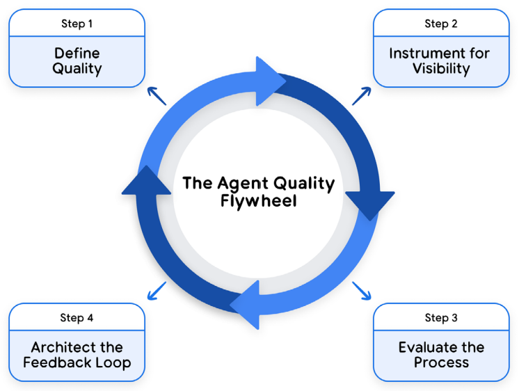
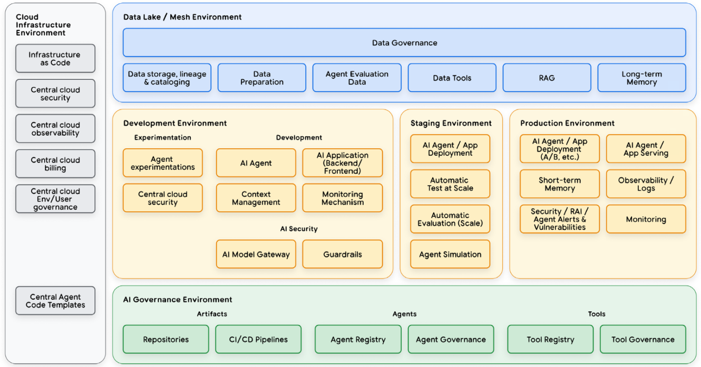

# Patterns

Agent design [patterns](https://rlancemartin.github.io/2026/01/09/agent_design):

- Give agents a computer (CLI and files)
- Progressive disclosure
- Offload context
- Cache context
- Isolate context
- Evolve context


## Architecture

General agent [components](https://www.kaggle.com/whitepaper-agents):

- LLM (brain)
- Prompting (instructions)
- Memory
- External knowledge
- Tools

AI Agent system use LLMs as core reasoning engine,
augmented with tools, memory, and instructions.


## Long Running

[Three-agent architecture](https://www.anthropic.com/engineering/harness-design-long-running-apps)
harness design (`Planner` + `Generator` + `Evaluator`)
produce rich full-stack applications
over multi-hour autonomous coding sessions.

自主编码正[从`更好的提示`转向`更好的控制系统`](https://nlp.elvissaravia.com/p/autonomous-long-running-coding-agents):
围绕 agent 设计**目标、评估器、循环、产物**,
使其在人停止输入后仍能规划、执行、自检、纠错、持续推进,
agent 仍是执行者, 但人不再逐轮交互.

### Goal as Contract

`/goal` 规定期望终态、成功证据、约束、轮次与预算, 而非更长的提示:

- 弱目标让模型提前停止或重定义成功
- 强目标编码领域知识 (基准、截图、约束) 供反复自测

### Verifier

自主性只在拥有可靠验证器时成立:

- 外部检查优于 agent 对`已完成`的自我解释
- 确定性检查 (类型、测试、lint) 作下限, LLM 评审作高层复核
- 详见 [evaluation](./evaluation.md)

### Loop

目标给方向, 循环让工作存活, 模型常在真正完成前停止:

- 外层控制系统: 唤醒 -> 检查 -> 验证 -> 对照目标 -> 带回下一步
- 最简形式即 [Ralph loop](../prompt/recipes/ralph.md) + 确定性条件

### Model Choice as Architecture

`模型`是架构决策而非单一选择:

- 规划模型定目标/约束, 执行模型跑实现, 廉价模型做评估/视觉评审
- 编排器让你交换角色, 而非等待单一厂商

### Artifacts

多 agent 并行时终端记录不可扩展, 分离存储与呈现:

- Markdown 存持久证据, 供 agent 搜索
- HTML 产物渲染可视化仪表盘 (loss 曲线、基准、截图), 供人监控
- 产物是控制面, 非事后报告

### Session Mining

过往会话是工作流数据富矿:

- 重复失败、漏跑检查、重试坏命令不该埋在日志里
- 扫描近期记录, 把重复失败模式转为项目指令/规则, 让本地环境更聪明而非从零训练模型

## First-Principles

从李世石与 `AlphaGo` 的围棋对战中的第 37 手,
我们可以总结出[第一性原理](https://www.chasewhughes.com/writing/beyond-the-replica-the-case-for-first-principles-agents)
智能体的基本原则:

- Replica agents: 当流程需要人工审核、代理作为用户的副驾驶员或与仅限 UI 的旧版工具集成时，使用仿生学。
- Alien agents: 当目标是纯粹的结果效率时，使用第一性原理。

## Asymmetry of Verification and Verifiers

Asymmetry of verification and verifiers [law](https://www.jasonwei.net/blog/asymmetry-of-verification-and-verifiers-law):

所有可解决且易于验证的问题, 都将被 AI 解决.

:::caution[Agent Traffic]

[Among the agents](https://www.hyperdimensional.co/p/among-the-agents):

Value of highly polished UI and enterprise applications will decrease,
value of performant, reliable, extensible API will increase.

:::

## Agent-Native

[Agent-native](https://every.to/guides/agent-native) apps should:

- Parity (对等性): 用户通过 UI 完成任务 `<->` Agent 通过工具实现.
- Granularity (细粒度): tools should be atomic primitives.
- Composability: 有了上述两点, 只需编写新的提示词即可创建新功能.
- Emergent capability.
- Files as universal interface: files for legibility, databases for structure.
- Improvement over time:
  - Accumulated context: state persists across sessions.
  - Developer-level refinement: system prompts.
  - User-level customization: user prompts.

```md
**Who I Am**:
Reading assistant for the Every app.

**What I Know About This User**:
- Interested in military history and Russian literature
- Prefers concise analysis
- Currently reading *War and Peace*

**What Exists**:
- 12 notes in /notes
- three active projects
- User preferences at /preferences.md

**Recent Activity**:
- User created "Project kickoff" (two hours ago)
- Analyzed passage about Austerlitz (yesterday)

**My Guidelines**:
- Don't spoil books they're reading
- Use their interests to personalize insights

**Current State**:
- No pending tasks
- Last sync: 10 minutes ago
```

:::tip[Agent-native Product]

Build capable foundation,
observe what users ask agent to do,
**formalize patterns** that emerge:

- Common patterns: domain tools.
- Frequent requests: dedicated prompts.
- Unused tools: remove.

:::

## Self-Evolving

Self-evolving [agents](https://github.com/CharlesQ9/Self-Evolving-Agents),
use runtime experience and external signals to optimize future behavior:

- Update evaluation datasets.
- Enhanced context engineering.
- Tool optimization and creation.
- Refine guardrails.

[](https://www.kaggle.com/whitepaper-agent-quality)

## Compound

[Compound engineering](https://every.to/chain-of-thought/compound-engineering-how-every-codes-with-agents)
(复利工程), 每个 PR 都在教育系统, 每个 bug 都成为永久的教训, 每次代码审查都在更新 agent 的默认行为:

- 将经验沉淀到项目文档.
- 让 bug 修复产生长期价值.
- 从代码审查中提取模式.
- 建立可复用的工作流程: slash commands, hooks, guardrails, and skills.
- Linter rules, regression tests, `AGENTS.md` improvements, checklist updates.

## `AgentOps`

[](https://www.kaggle.com/whitepaper-prototype-to-production)

## References

- Agents [whitepaper](https://www.kaggle.com/whitepaper-agents)
- Agentic [patterns](https://github.com/nibzard/awesome-agentic-patterns)
- Agent 系统设计[指南](https://mp.weixin.qq.com/s/8ArJk0vpGP0o97kEtqscqA)
- Coding agent design [patterns](https://mariozechner.at/posts/2025-11-30-pi-coding-agent)
