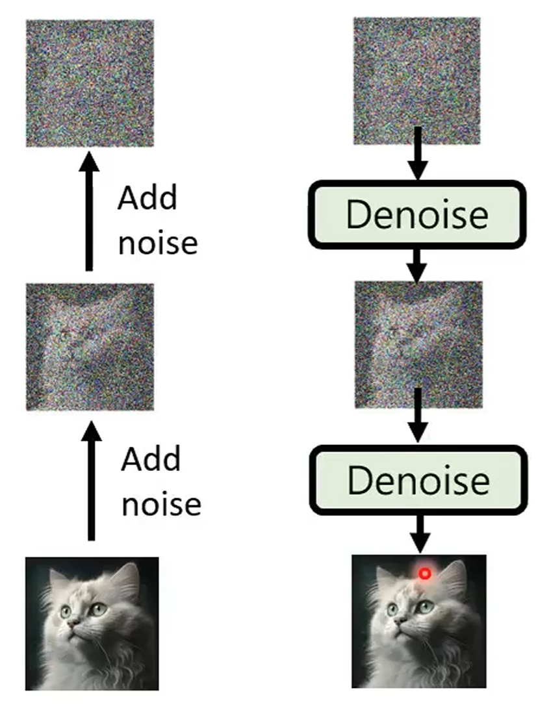
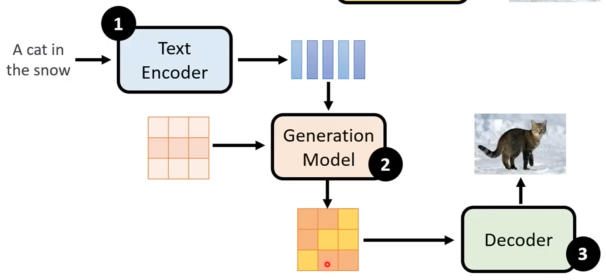
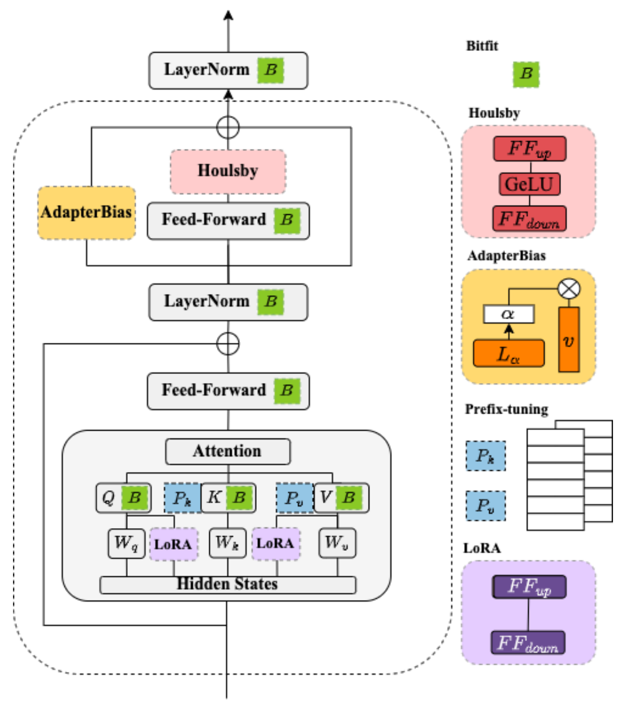
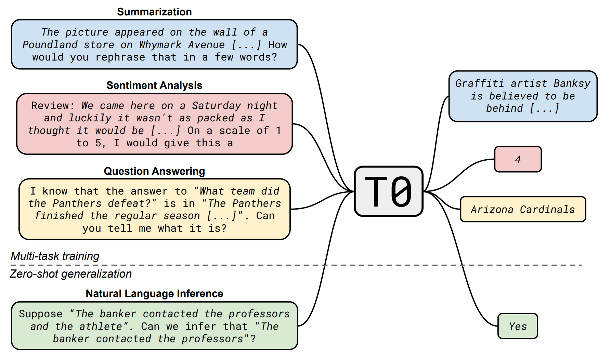

# Large Language Model

Pre-trained models + fine-tuning (downstream tasks):

- Cross lingual.
- Cross discipline.
- Pre-training with artificial data.
- Long context window.


## Generative Model

- Autoregressive (`AR`) model:
  generate output one token at a time, conditioned on previous tokens.
- Non-autoregressive (`NAR`) model:
  generate output all at once parallel, without conditioning on previous tokens.

|             | `AR` Model | `NAR` Model |
| ----------- | :--------: | :---------: |
| Parallelism |    Low     |    High     |
| Speed       |    Slow    |    Fast     |
| Quality     |    High    |     Low     |

结合上述两种方法 (Encoder + Decoder 架构):

- 用 `AR` model 生成中间向量, 用 `NAR` model 生成最终输出.
- 用 `NAR` model 多次生成, 逐步优化输出.
- Speculative decoding:
  用 `NAR` model 快速生成若干个预测输出, 作为 `AR` model 的后续输入,
  使得 `AR` model 可以同时输出多个结果.


### ChatGPT

Fine-tuned GPT model on conversational data:

- Pre-training:
  学习文字接龙, 学习大规模资料 (self-supervised learning), 生成下一个单词.
- Supervised fine-tuning (`SFT`):
  人工文字接龙, 人工标注部分问题的答案 (supervised learning), 引导模型生成的方向.
- Reinforcement learning from human feedback
  ([`RLHF`](https://nips.cc/virtual/2022/52886)):
  训练一个 reward model, 负责评价模型生成的答案, 提供人类反馈.
  以 reward model 的评价分数为 reward, 通过强化学习优化模型.
  一般聚焦于三个方面: 有用性 (Helpfulness), 诚实性 (Honesty), 无害性 (Harmlessness).

$$
\mathcal{L}_{\text{pretrain}} = - \sum_{t=1}^{T} \log P(x_t | x_1, x_2, \dots, x_{t-1}; \theta)
$$

$$
\mathcal{L}_{\text{SFT}} = - \sum_{i=1}^{N} \log P(y_i | x_i; \theta)
$$

$$
\mathcal{L}_{\text{RM}} = - \mathbb{E}_{(x, y_w, y_l)} [\log \sigma(r_\phi(x, y_w) - r_\phi(x, y_l))]
$$

$$
J_{\text{PPO}} = \mathbb{E}_{x, y \sim \pi_\theta} [r_\phi(x, y)] - \beta \cdot D_{\text{KL}}(\pi_\theta \| \pi_{\text{ref}})
$$

:::tip[Alignment]

对齐的[最佳方法](https://cameronrwolfe.substack.com/p/understanding-and-using-supervised):

1. 在适中规模的高质量示例数据集上执行 `SFT`.
2. 将剩余精力投入到整理人类偏好数据, 以便通过 `RLHF` 进行微调.

:::

### Diffusion

Forward process (diffusion) + reverse process (de-noise):

[](https://nips.cc/virtual/2020/protected/poster_4c5bcfec8584af0d967f1ab10179ca4b.html)

Stable diffusion model:

[](https://ieeexplore.ieee.org/document/9878449)

### Video

Generative videos as world models simulator.

## Pre-Trained Models

Pre-trained data:

- Content filtering: 去除有害内容.
- Text extraction: 去除 HTML 标签.
- Quality filtering: 去除低质量内容.
- Document deduplication: 去除重复内容.

### BERT

BERT (Bidirectional Encoder Representations from Transformers) 是一种 Encoder-only 预训练模型,
通过大规模无监督学习, 学习文本的语义信息, 用于下游任务的微调:

- Masked token prediction: 随机遮挡输入文本中的一些词, 预测被遮挡的词.
- Next sentence prediction: 预测两个句子的顺序关系.


### GPT

GPT (Generative Pre-trained Transformers) 是一种 Decoder-only 预训练模型.

## Fine-Tuning

### BERT Adapters

[](https://ieeexplore.ieee.org/document/10023274)

### Supervised Fine-Tuning

```python
from transformers import AutoModelForCausalLM
from datasets import load_dataset
from trl import SFTTrainer

dataset = load_dataset("imdb", split="train")

model = AutoModelForCausalLM.from_pretrained("facebook/opt-350m")

trainer = SFTTrainer(
    model,
    train_dataset=dataset,
    dataset_text_field="text",
    max_seq_length=512,
)

trainer.train()
```

### Instruction-Tuning

Make model can understand human instructions not appear in training data:

[](https://iclr.cc/virtual/2022/7102)

- 提高指令复杂性和多样性能够促进模型性能的提升.
- 更大的参数规模有助于提升模型的指令遵循能力.

### Low-Rank Adaptation

低秩适配 (LoRA) 是一种参数高效微调技术 (Parameter-efficient Fine-tuning),
其基本思想是冻结原始矩阵 $W_0\in\mathbb{R}^{H\times{H}}$,
通过低秩分解矩阵 $A\in\mathbb{R}^{H\times{R}}$ 和 $B\in\mathbb{R}^{H\times{R}}$
来近似参数更新矩阵 $\Delta{W}=A\cdot{B^T}$,
其中 $R\ll{H}$ 是减小后的秩:

$$
\begin{equation}
  W=W_0+\Delta{W}=W_0+A\cdot{B^T}
\end{equation}
$$

在微调期间, 原始的矩阵参数 $W_0$ 不会被更新,
低秩分解矩阵 $A$ 和 $B$ 则是可训练参数用于适配下游任务.
LoRA 微调在保证模型效果的同时, 能够显著降低模型训练的成本.

## Reinforcement Learning from Human Feedback

### Proximal Policy Optimization

限制策略更新的变化幅度:

$$
r_t(\theta) = \frac{\pi_{\theta}(a_t | s_t)}{\pi_{\theta_{\text{old}}}(a_t | s_t)}
$$

裁剪 (clipping) 幅度过小或过大的部分,
这就是 `近端` 的含义.

### Group Relative Policy Optimization

`PPO` 四个模型 (actor, critic, reference, reward), 需要计算成本与大量显存.
[`GRPO`](https://cameronrwolfe.substack.com/p/grpo-tricks)
对于同一问题 (prompt), 一次性生产一组答案,
利用平均分 (group relative) 估计优势:

$$
\hat{A}_{i,t} = \frac{r_i - \text{mean}(\mathbf{r})}{\text{std}(\mathbf{r})}
$$

从而移除 critic 模型:

$$
J_{\text{GRPO}}(\theta) = \mathbb{E}_{s,a \sim \pi_\theta} \left[ \frac{\pi_\theta(a|s)}{\pi_{\text{ref}}(a|s)} \cdot (r(s,a) - \bar{r}_{\text{group}}) \right] - \beta \cdot D_{\text{KL}}(\pi_\theta || \pi_{\text{ref}})
$$

### Agentic RL

- Reasoning: 通过试错学习有效的推理策略, 发现训练数据中没有的推理路径
- Tool Use: 学会何时使用工具、选择哪个工具、如何组合多个工具
- Memory: 学会记忆管理策略, 决定哪些信息值得记住、何时更新/删除
- Planning: 学会动态规划, 权衡短期和长期收益, 发现有效的行动序列
- Self-Improvement: 学会自我反思, 识别错误、分析失败原因、调整策略
- Perception: 提升多模态理解能力, 学会视觉推理、使用视觉工具和视觉规划


## Reasoning

Test-time compute (inference-time compute):
prompting models to generate intermediate [reasoning steps](https://arxiv.org/abs/2201.11903)
dramatically improved performance on [hard problems](https://cameronrwolfe.substack.com/p/demystifying-reasoning-models):

- Long `CoT` and inference-time scaling:
  推理模型不是直接生成最终答案, 而是生成一个详细描述其推理过程的长 `CoT`.
  通过控制长 `CoT` 的长度, 可以控制计算成本, 动态控制推理能力.
- Reasoning model can self-evolution with RL and need less supervision.

:::tip

Thinking tokens are model's only persistent memory during reasoning.

:::

## Inference Acceleration

- Quantization: 改变模型权重和激活值的精度.
- Distillation: data, knowledge, on policy.
- Flash attention: minimize data move between slow `HBM` to faster memory tier (`SRAM`/`VMEM`).
- Prefix caching: avoid recalculating attention scores for input on each auto-regressive decode step.
- Speculative decoding: generate multiple candidates with drafter model (much smaller).
- Batching and parallelization: sequence, pipeline, tensor.

## Embeddings

[Various types](https://kaggle.com/whitepaper-embeddings-and-vector-stores):

- Continuous bag of words (`CBOW`):
  Predict middle word, with embeddings of surrounding words as input.
  Fast to train and accurate for frequent words.
- Skip-gram:
  predict surrounding words in certain range, with middle word as input.
  Slower to train but accurate for rare words.
- `GloVe`/SWIVEL:
  Capture both global and local information about words with co-occurrence matrix.
- Shallow `BoW`.
- Deeper pre-trained.
- Multimodal: image.
- Structured data.
- Graph.


:::tip[Recommendation Systems]

Maps two sets of data (user dataset, item/product/etc dataset)
into the same embedding space.

:::

Embeddings + `ANN` (approximate nearest neighbor) vector stores
(`ScaNN`, `FAISS`, `LSH`, `KD-Tree`, and `Ball-Tree`):

- Retrieval augmented generation (RAG).
- Semantic text similarity.
- Few shot classification.
- Clustering.
- Recommendation systems.
- Anomaly detection.


## Retrieval-Augmented Generation

检索增强生成, 通常称为 RAG (Retrieval-Augmented Generation),
是一种强大的聊天机器人的设计模式.
其中, 检索系统实时获取与查询相关的经过验证的源 / 文档,
并将其输入生成模型 (例如 GPT-4) 以生成响应.

1. 数据处理阶段:
   - 对原始数据进行清洗和处理
   - 将处理后的数据转化为检索模型可以使用的格式
   - 将处理后的数据存储在对应的数据库中
2. 检索阶段:
   将用户的问题输入到检索系统中, 从数据库中检索相关信息
3. 增强阶段:
   对检索到的信息进行处理和增强, 以便生成模型可以更好地理解和使用
4. 生成阶段:
   将增强后的信息输入到生成模型中, 生成模型根据这些信息生成答案


:::tip

- Effect: reduce hallucination.
- Cost: avoid retraining.

:::

### Context

Context is everything when it comes to getting the most out of an AI tool.
[Improve the relevance and quality of the input](https://github.blog/2024-04-04-what-is-retrieval-augmented-generation-and-what-does-it-do-for-generative-ai),
to improve the relevance and quality of a generative AI output.

:::tip

[Quality in, quality out.](https://github.blog/2024-04-04-what-is-retrieval-augmented-generation-and-what-does-it-do-for-generative-ai)

:::

### Diversity

最大边际相关模型 (`MMR`, Maximal Marginal Relevance) 是实现多样性检索的常用算法:

它计算 `fetch_k` 个候选文档与查询的相关度,
并减去与已经选入结果集的文档的相似度,
这样更不相似的 `k` 个文档会有更高的得分.

### Constraint

实现约束化检索:

- Metadata: 利用文档的元数据 (如时间戳、来源、类别等) 进行结构化约束.
- Self-Query: 根据用户输入的问题, 模型自身生成适合检索系统使用的查询 (query), 而不是提前人工设计关键词或标签.

### Efficiency

- Prompt compression: 去除冗余文本
- RAG cache: 复用计算结果

### Agentic

Agentic RAG (autonomous retrieval agents)
actively refine their search based on iterative reasoning:

- Multi-query expansion (`MQE`):
  利用 LLM 生成语义等价的多样化查询
- Context-aware query expansion:
  利用 LLM 生成与当前上下文相关的查询
- Hypothetical document embeddings (`HyDE`):
  利用 LLM 生成假设性的答案段落, 用假设段落去检索真实文档
- Multistep reasoning
- Adaptive source selection
- Validation and correction

## Scaling Law

现有的预训练语言模型对于数据的需求量远高于扩展法则
(e.g. [Chinchilla](https://nips.cc/virtual/2022/53031)) 中所给出的估计规模.
很多更小的模型也能够通过使用超大规模的预训练数据获得较大的模型性能提升.
这种现象的一个重要原因是由于 Transformer 架构具有较好的数据扩展性.
目前为止, 还没有实验能够有效验证特定参数规模语言模型的饱和数据规模
(即随着数据规模的扩展, 模型性能不再提升).

## Emergent Ability

大语言模型的涌现能力被非形式化定义为
`在小型模型中不存在但在大模型中出现的能力`:

- In-context learning.
- Instruction following.
- Step-by-step reasoning.

## Hallucination

Reduce factual, faithfulness, and intrinsic hallucinations:

1. Data: high quality and factual data.
2. RAG.
3. Validation: multistep reasoning, fact-checking, consistency checking, etc.
4. External tools: search engine, calculator, interpreter, etc.

## Recursive Language Models

[`RLM`](https://www.primeintellect.ai/blog/rlm)
通过分治与递归, 实现多跳推理代码, 解决长文本带来的 `Context Rot` 问题.

## Library

### Embeddings and Vector Stores

- [`OpenCLIP`](https://github.com/mlfoundations/open_clip):
  Encodes images and text into numerical vectors.
- [Chroma](https://github.com/chroma-core/chroma):
  AI-native embedding database.
- [`FaISS`](https://github.com/facebookresearch/faiss):
  Similarity searching and dense vectors clustering library.

### Text-to-Speech

- [`MiniMax`](https://www.minimax.io/audio/text-to-speech):
  `MiniMax` voice agent.
- [`ChatTTS`](https://github.com/2noise/ChatTTS):
  Generative speech model for daily dialogue.
- [`ChatterBox`](https://github.com/resemble-ai/chatterbox):
  `SoTA` open-source TTS model.

### LLMs

- [`OLlama`](https://github.com/ollama/ollama):
  Get up and running large language models locally.
- [GUI](https://github.com/open-webui/open-webui):
  User-friendly web UI for LLMs.
- [Transformers](https://github.com/xenova/transformers.js):
  Run Hugging Face transformers directly in browser.
- [Jan](https://github.com/janhq/jan):
  Offline local ChatGPT.
- [Local](https://github.com/vince-lam/awesome-local-llms):
  Locally running LLMs.

## References

- 大语言模型[综述](https://github.com/LLMBook-zh/LLMBook-zh.github.io).
- Efficient LLM architectures [survey](https://github.com/weigao266/Awesome-Efficient-Arch).
- Foundational LLM [whitepaper](https://www.kaggle.com/whitepaper-foundational-llm-and-text-generation).
- Text-to-video generation [survey](https://arxiv.org/abs/2403.05131).
- LLMs safety [survey](http://github.com/XSafeAI/AI-safety-report).
